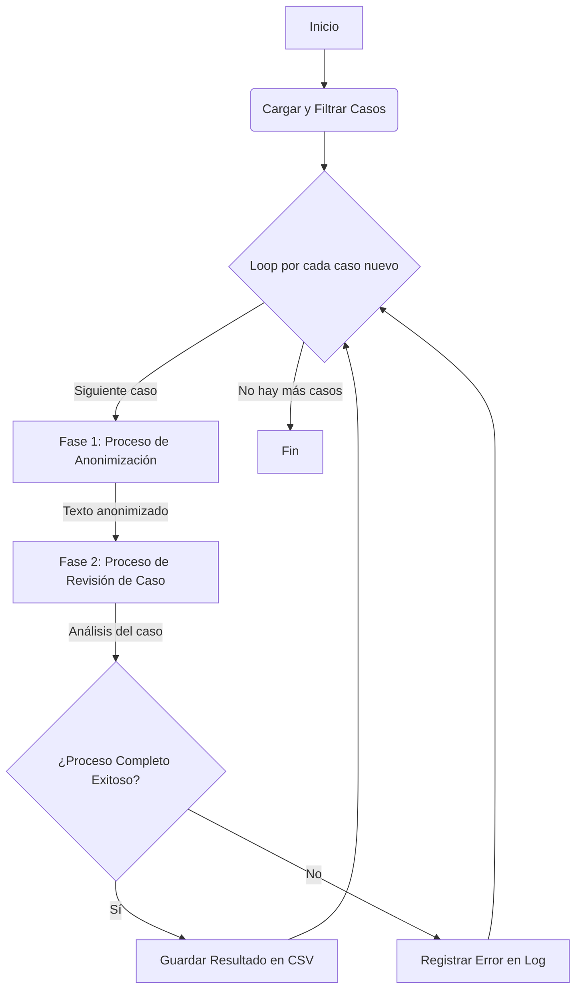

# Proyecto: Pipeline de Procesamiento de Casos con Agentes de IA

Este proyecto implementa un pipeline automatizado para procesar informes de casos de soporte. El sistema utiliza un enfoque de múltiples agentes de IA que colaboran en un flujo de trabajo secuencial para anonimizar y luego clasificar cada caso.

## Diagrama del Flujo de Trabajo

## Descripción Detallada del Workflow

El proceso se divide en dos fases principales, ambas supervisadas por un agente "Juez" para garantizar la calidad del resultado.

### Fase 1: Anonimización - Para cumplir la GDPR

1.  **Entrada**: El texto original del informe de un caso.
2.  **Agente Anonimizador**: Recibe el texto y lo procesa para reemplazar toda la información sensible (nombres, direcciones, etc.) con etiquetas genéricas (ej: `[NOMBRE]`, `[LUGAR]`). Este agente utiliza un modelo de lenguaje local a través de Ollama (`qwen3:4b`).
3.  **Agente Juez de Anonimización**: Compara el texto original con la versión anonimizada. Su única tarea es verificar si *toda* la información sensible ha sido eliminada.
4.  **Validación**:
    *   Si el Juez aprueba la anonimización, el texto anonimizado pasa a la siguiente fase.
    *   Si el Juez la rechaza, el proceso se reintenta desde el paso 2 hasta un máximo de 5 veces. Si se supera el límite de reintentos, el caso se marca con un error y se salta.

### Fase 2: Revisión y Clasificación del Caso

1.  **Entrada**: El texto anonimizado de la fase anterior.
2.  **Agente Revisor de Casos**: Analiza el informe anonimizado para extraer información estructurada: el estado del caso (`status`), las acciones a seguir (`actions`), información adicional (`info`) y el departamento al que debe ser asignado (`department`). Este agente utiliza los modelos de GPT para analizar los casos.
3.  **Agente Juez de Revisión**: Evalúa el análisis JSON generado por el Revisor. Comprueba si la clasificación es lógica, coherente con el informe y si el departamento asignado es el correcto según las descripciones proporcionadas.
4.  **Validación**:
    *   Si el Juez aprueba la revisión, el resultado final se considera válido.
    *   Si el Juez la rechaza, el proceso se reintenta desde el paso 2 hasta un máximo de 5 veces. Si se supera el límite, el caso se marca con un error.

### Salida

El resultado final de cada caso procesado con éxito (un objeto JSON con el `caseID`, `status`, `actions`, `info` y `department`) se guarda en un archivo `processed_cases.csv` para mantener un registro y evitar procesar el mismo caso dos veces.

## Estructura del Proyecto

-   `main.py`: El orquestador principal del pipeline. Gestiona la carga de datos, el filtrado de casos ya procesados, la ejecución de las fases y el guardado de resultados.
-   `agentes.py`: Contiene las funciones para crear y configurar los cuatro agentes de IA utilizados en el proceso.
-   `herramientas.py`: Módulo con funciones de utilidad para interactuar con el sistema de archivos (cargar JSON, leer y escribir en CSV).
-   `clases.py`: Define las estructuras de datos (`Pydantic models`) que se utilizan para las respuestas de los agentes, como `JudgeDecision`, `TextoAnonimizado` y `CaseStatus`.
-   `instrucciones.py`: Almacena los prompts y las instrucciones detalladas que se proporcionan a cada agente para guiar su comportamiento.
-   `cases.json`: Archivo de entrada que contiene la lista de casos a procesar, cada uno con un `caseID` y un `report`.
-   `departments.json`: Archivo de configuración que contiene las descripciones de los departamentos para que los agentes de revisión puedan asignar los casos correctamente.

## Requisitos

-   Python 3.11+
-   Una clave de API de OpenAI configurada en un archivo `.env`.
-   Tener [Ollama](https://ollama.com/) instalado y ejecutándose localmente con el modelo adecuado descargado, en este caso `qwen3:4b`.

